# Advanced Lane Finding Project

The goals / steps of this project are the following:

* Compute the camera calibration matrix and distortion coefficients given a set of chessboard images.
* Apply a distortion correction to raw images.
* Use color transforms, gradients, etc., to create a thresholded binary image.
* Apply a perspective transform to rectify binary image ("birds-eye view").
* Detect lane pixels and fit to find the lane boundary.
* Determine the curvature of the lane and vehicle position with respect to center.
* Warp the detected lane boundaries back onto the original image.
* Output visual display of the lane boundaries and numerical estimation of lane curvature and vehicle position.

## Image References

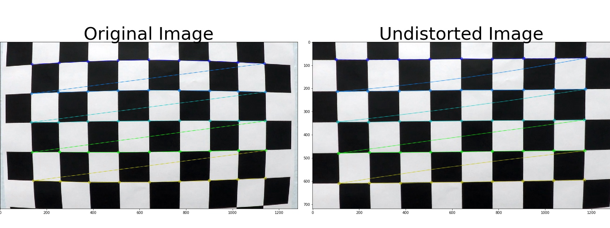
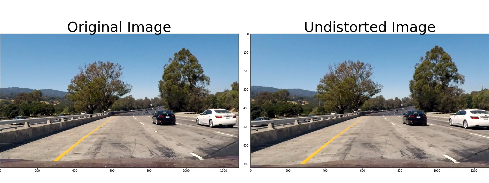
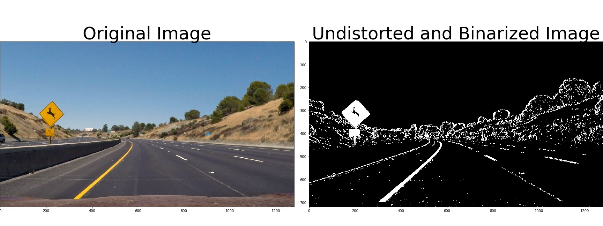
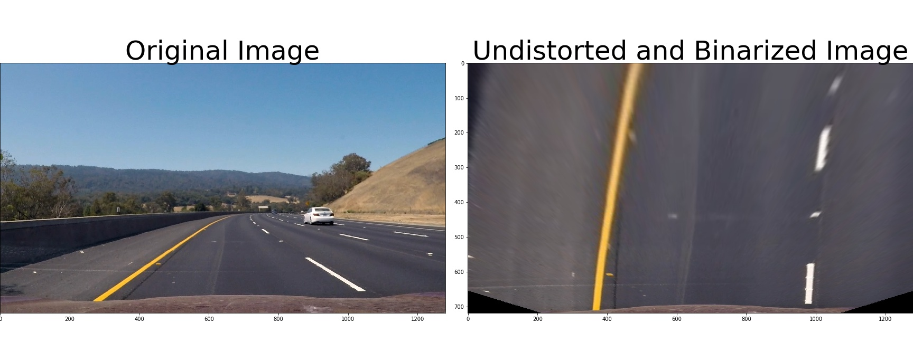
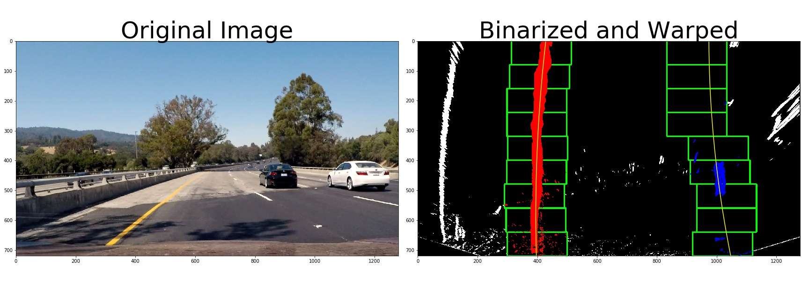
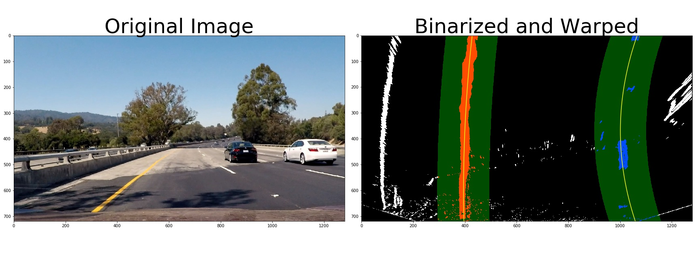
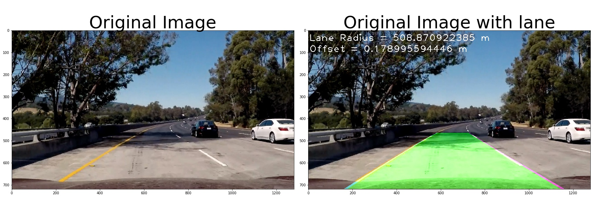

<video width="480" height="270" controls>
  <source src="./project_video.mp4">
</video>

## Rubric Points

- [Rubric](https://review.udacity.com/#!/rubrics/571/view) Points


## Camera Calibration

#### 1. Briefly state how you computed the camera matrix and distortion coefficients. Provide an example of a distortion corrected calibration image.

The code for this step is contained in the first code cell of the IPython notebook located in "./02-pipeline.ipynb".

I start by preparing "object points", which will be the (x, y, z) coordinates of the chessboard corners in the world. Here I am assuming the chessboard is fixed on the (x, y) plane at z=0, such that the object points are the same for each calibration image.  Thus, `objp` is just a replicated array of coordinates, and `objpoints` will be appended with a copy of it every time I successfully detect all chessboard corners in a test image.  `imgpoints` will be appended with the (x, y) pixel position of each of the corners in the image plane with each successful chessboard detection.

I then used the output `objpoints` and `imgpoints` to compute the camera calibration and distortion coefficients using the `cv2.calibrateCamera()` function.  I applied this distortion correction to the test image using the `cv2.undistort()` function and obtained this result:

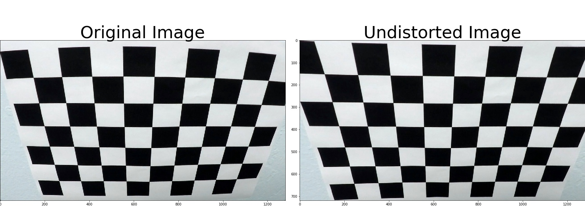

## Pipeline (single images)

### 1. Provide an example of a distortion-corrected image.

To demonstrate this step, I will describe how I apply the distortion correction to one of the test images like this one:


### 2. Describe how (and identify where in your code) you used color transforms, gradients or other methods to create a thresholded binary image.  Provide an example of a binary image result.

I used a combination of color and gradient thresholds to generate a binary image (thresholding steps at lines # through # in `another_file.py`).  Here's an example of my output for this step.  (note: this is not actually from one of the test images)


I made a function `binarize_image` to get a binary image with a given RGB image.
First, I converted the given RGB image to a HLS image to stabilize extracting lines from it.
Next, I applied Sobel matrix with regard to X-axis to the L channel of the HLS image.
And then, I got values of Sobel-x, S channel and L channel based on threshold to make a binary image.
Finaly, I made a binary image with conditions of Sobel-x, S channel and L channel.

#### 3. Describe how (and identify where in your code) you performed a perspective transform and provide an example of a transformed image.

The code for my perspective transform includes functions called `warp_image()` and `get_perspective_transform_matrix`, which appear in the file `./02-pipeline.ipynb`.
The `warp_image()` function takes as inputs an image (`img`).
And `get_perspective_transform_matrix` is used for getting a transform matrix.
I chose the hardcode the source and destination points in the following manner:

```python
# src
src_corners = np.float32([
  [190, 720],
  [570, 465],
  [710, 465],
  [1100 , 720],
])
src = np.float32([src_corners[0], src_corners[1], src_corners[2], src_corners[3]])

# dst
new_top_left = np.array([src_corners[0][0], 0])
new_top_right = np.array([src_corners[3][0], 0])
offset = np.array([150, 0])
dst = np.float32([src_corners[0] + offset, new_top_left + offset, new_top_right - offset, src_corners[3] - offset])
```

This resulted in the following source and destination points:

| Source        | Destination   |
|:-------------:|:-------------:|
| 190, 720      | 340, 720      |
| 570, 465      | 340, 0        |
| 710, 465      | 950, 0        |
| 1100, 720     | 950, 720      |

I verified that my perspective transform was working as expected by drawing the `src` and `dst` points onto a test image and its warped counterpart to verify that the lines appear parallel in the warped image.


#### 4. Describe how (and identify where in your code) you identified lane-line pixels and fit their positions with a polynomial?

Then I did some other stuff and fit my lane lines with a 2nd order polynomial kinda like this:

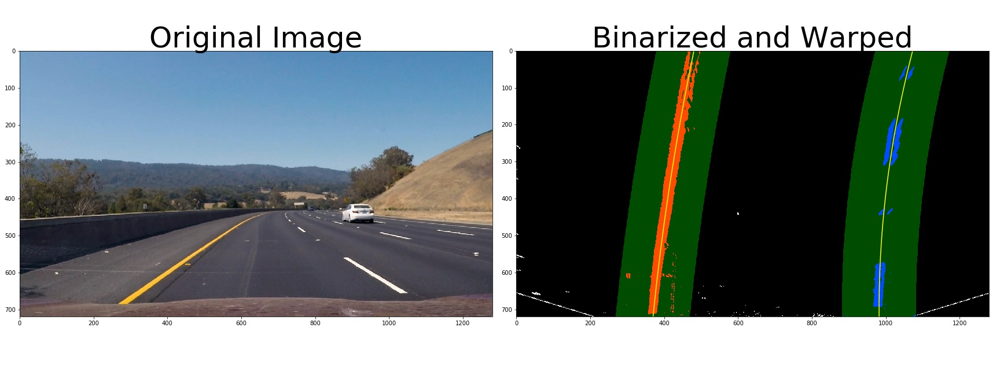

I made functions `find_lines_with_box` and `find_lines` to find the line of left and right lane in a image.
First, I got a histogram of a warped binary image to find lines in it and then found the peak of left and right halves of the histogram.
These will be the starting point for the left and right lines.

With this histogram I am adding up the pixel values along each column in the image.
In my thresholded binary image, pixels are either 0 or 1, so the two most prominent peaks in this histogram will be good indicators of the x-position of the base of the lane lines.
I can use that as a starting point for where to search for the lines.
From that point, I can use a sliding window, placed around the line centers, to find and follow the lines up to the top of the frame.

#### 5. Describe how (and identify where in your code) you calculated the radius of curvature of the lane and the position of the vehicle with respect to center.

I made functions `get_radius_carvature` and `get_offset`.
`get_radius_carvature` is used for getting the radius of curvature of the lane.
`get_offset` is used for getting the position of the vehicle with respect to center.

We say the curve and the circle osculate (which means "to kiss"), since the 2 curves have the same tangent and curvature at the point where they meet.

The radius of curvature of the curve at a particular point is defined as the radius of the approximating circle. This radius changes as we move along the curve.

How do we find this changing radius of curvature?

The formula for the radius of curvature at any point x for the curve y = f(x) is given by:
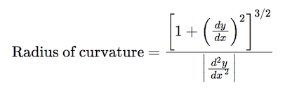

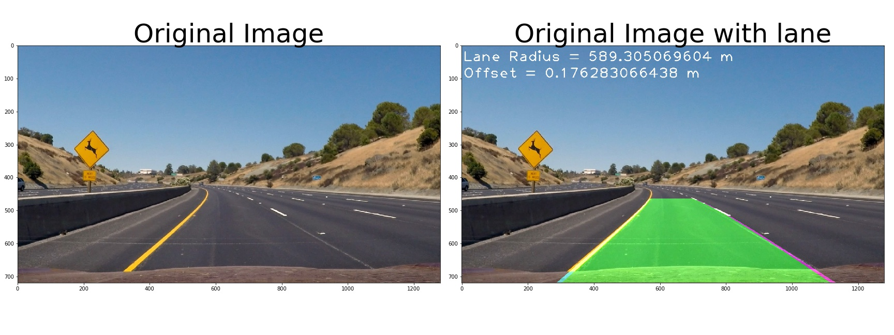


#### 6. Provide an example image of your result plotted back down onto the road such that the lane area is identified clearly.

I implemented this step as `draw_lane` in the `02-pipeline.ipynb`.
I added the lane area and the radius of curvature and the offset.
Here is an example of my result on a test image:


---

### Pipeline (video)

#### 1. Provide a link to your final video output.  Your pipeline should perform reasonably well on the entire project video (wobbly lines are ok but no catastrophic failures that would cause the car to drive off the road!).

Here's a [link to my video result](./project_video.mp4)

---

## Discussion

### 1. When a kind of line by construction works appear in the video, the lane recognition go wrong.

The lane recognition is not stable when something like a line appear between the lane of left and right.
I think this is because it cannot distinguish the real lane with the fake line.

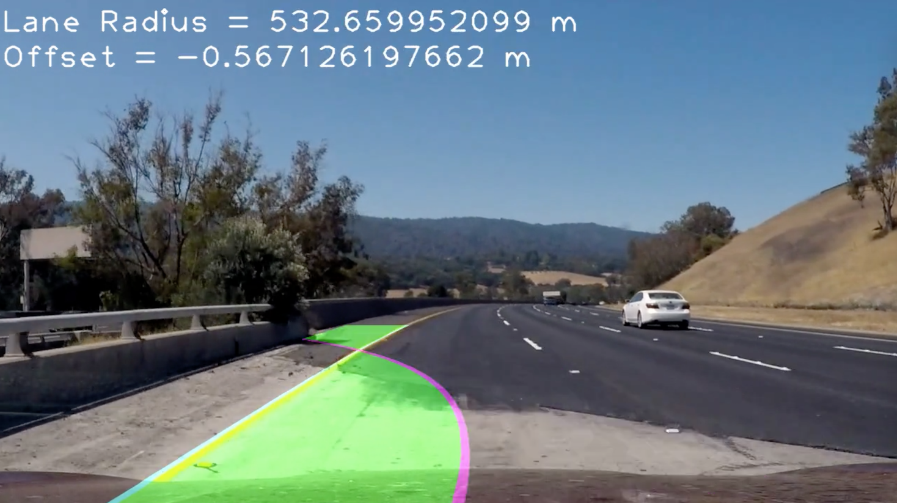
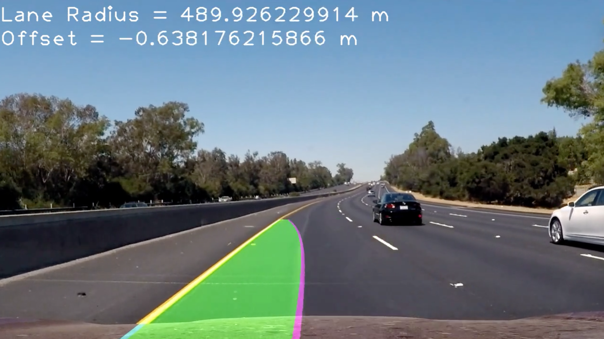
